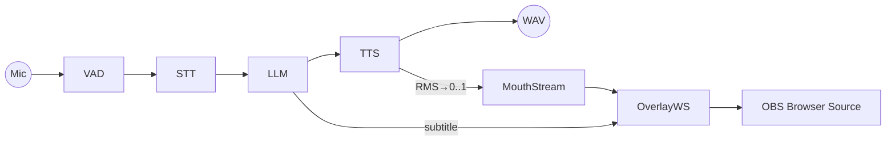

# アーキテクチャ
_最終更新: 2025-10-08

## コンポーネント図（Mermaid）

- **OverlayWS**: FastAPI+WebSocket サーバ。`/` で静的 HTML/JS を配布。
- **Browser**: OBS の Browser Source。透明背景で字幕・口パクを表示。

## デプロイ単位
- **apps/overlay**: ASGI（uvicorn）で単体起動可能。
- **apps/brain**: Python モジュールとして起動（`python -m apps.brain.main`）。

## WS イベント
- `utter_start` / `mouth` / `utter_end`（詳細は `docs/SPECIFICATION.md`）

## エラーハンドリング
- 例外はログに残し、**フォールバック**で継続。
- APIキー未設定/接続失敗 → ローカル/ダミーで代替。
